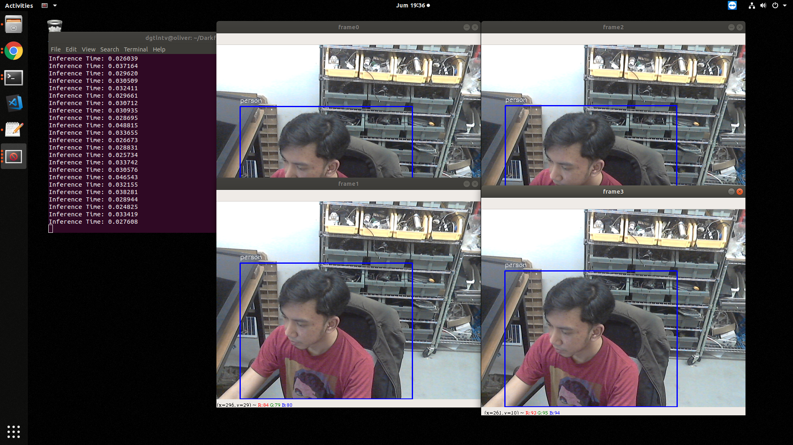

# DarkflowTensorRT
Python implementation of using Darkflow model with TensorRT

Tested using:
```
Ubuntu 18.04
Python 3.6.7
CUDA 10.0
CuDNN 7.5
TensorRT 5.1.2
darkflow
tensorflow-gpu 1.13.1
OpenCV 4.0.1

Nvidia GTX 1050 Ti
```

# Demo
```
python3 demo.py
```


